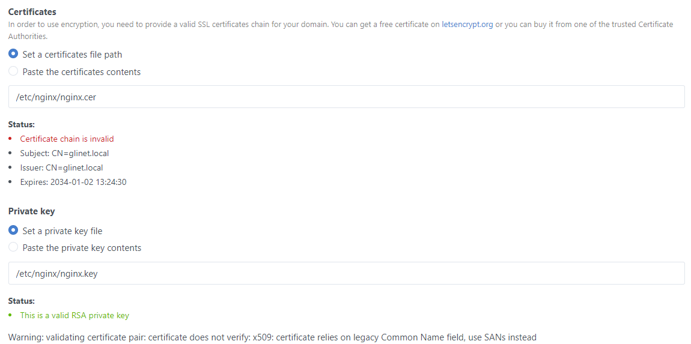

# GliNet Router Hardening
---
The GliNet travel routes are quite useful, especially as they support a wide range of addons like AdGuard.

If you have enabled AdGuard as I did, the router will always redirect to HTTP. Since the login data is stored within a cookie, everyone on that network could potentially sniff it and use it to log in.

Now, we are going to change that!

## Harden the webserver
Because we want to use HTTP everywhere, we need to create a self-signed certificate and put it into `/etc/nginx/`:

```shell
openssl req -x509 -newkey rsa:4096 -keyout nginx.key -out nginx.cer -sha256 -days 3650
```

Next we need to slightly modify the nginx config, so that it will always upgrade to an HTTPS connection (at least on port 80). After that, simply restart the webserver.

```conf #5,7-12,23-25
# SNIP

# Add headers and remove server_tokens
server_tokens off;
add_header Content-Security-Policy "upgrade-insecure-requests" always;

# Automatically redirect to HTTPS
server {
    listen 80;
    listen [::]:80;
    return 301 https://$host$request_uri;
}

server{
    listen 443 ssl;
    listen [::]:443 ssl;
    
    ssl_protocols TLSv1.1 TLSv1.2;
    ssl_prefer_server_ciphers on;
    ssl_ciphers "EECDH+ECDSA+AESGCM:EECDH+aRSA+AESGCM:EECDH+ECDSA+SHA384:EECDH+ECDSA+SHA256:EECDH+aRSA+SHA384:EECDH+aRSA+SHA256:EECDH:DHE+AESGCM:DHE:!RSA!aNULL:!eNULL:!LOW:!RC4:!3DES:!MD5:!EXP:!PSK:!SR    P:!DSS:!CAMELLIA:!SEED";
    ssl_session_tickets off;
    
	# Add certificates
    ssl_certificate /etc/nginx/nginx.cer;
    ssl_certificate_key /etc/nginx/nginx.key;
    
	# SNIP
}
```

If everything worked out, you should now be automatically redirected to HTTPs. Hooray!

!!!
You can also add other headers like HSTS, which would prevent the browser from ever connecting over HTTP. But if an update would happen to revert the config back, you wouldn't be able to connect without clearing HSTS in your browser. 
!!!

## Hardening AdGuard
If you use AdGuard on your travel router to block certain domains, you can (and should) configure it to use your previously added certificate. It will complain that the certificate is invalid, but in our case self signed certificates are OK (you can also issue a real one).



## The problem with insecure cookies
Since nginx does not append the `secure` flag on cookies, if your browser gets redirected it might happen, that it tries so over HTTP. This would expose your session cookie again, which we try to prevent.

Since the GliNet UI would always redirect to AdGuard using HTTP, we can either change the UI, or add the `secure` flag to our cookie, which is probably easier.

To do that, change the the following line in file `/usr/share/gl-ngx/oui-rpc.lua` and restart nginx.

=== Old
```lua
ngx.header["Set-Cookie"] = "Admin-Token=" .. data.sid
```
=== New
```lua
-- Add ` .. "; Secure;"`
ngx.header["Set-Cookie"] = "Admin-Token=" .. data.sid .. "; Secure;"
```
===