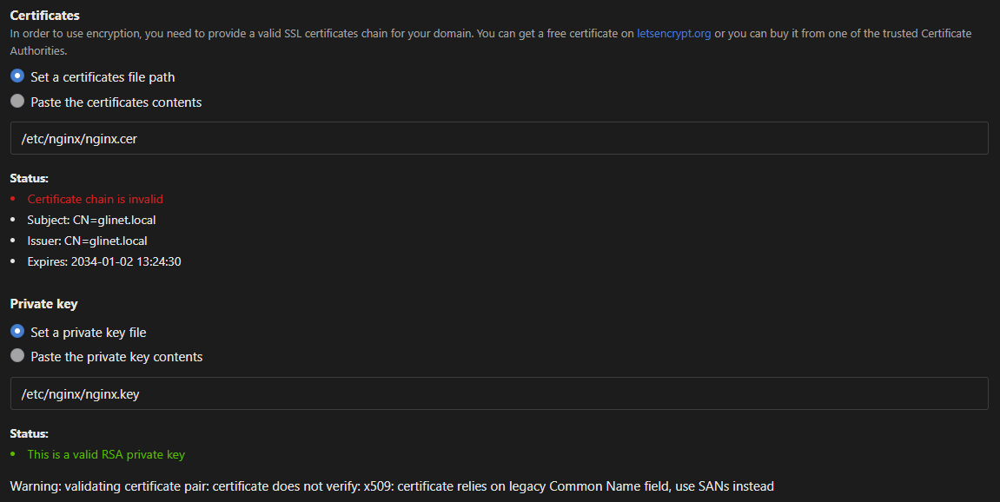

# GL.iNet Router Hardening
---
!!!
This guide applies to firmware version v4.5.19 - There might be some differences between older versions. Also some of these changes may be removed during an update (mainly applies to direct config file changes). For this demonstration, I used the GL.iNet GL-A1300 (which already uses end-of-life packages :/).
!!!

The GL.iNet travel routes are quite useful, not only because they are small, but also because they support a wide range of addons like AdGuard or Wireguard. 

While these routers are nice to travel with, there are some settings which can improve security on these devices.

This is not an exhaustive list, but something I noticed while toying around with this router for a bit:
1. Harden the webserver
2. Enable HTTPS on AdGuard
3. Fixing insecure cookies

## Harden the webserver
After the login, we navigate to the security page and enable the toggle `Force HTTPS`. This causes nginx to reboot and we have to log in again. Since we are already in the security page, we may disable all `Remote Access Control` settings, unless required.


Next we take a look at the TLS protocols. The nginx configuration file for this router is located at `/etc/nginx/conf.d/gl.conf`:

```conf #11 ./gl.conf
# ...SNIP
init_by_lua_file /usr/share/gl-ngx/oui-init.lua;

server {
	listen 80;
    listen [::]:80;
    
    listen 443 ssl;
    listen [::]:443 ssl;
    
    ssl_protocols TLSv1 TLSv1.1 TLSv1.2;
    
    ssl_prefer_server_ciphers on;
    ssl_ciphers "EECDH+ECDSA+AESGCM:EECDH+aRSA+AESGCM:EECDH+ECDSA+SHA384:EECDH+ECDSA+SHA256:EECDH+aRSA+SHA384:EECDH+aRSA+SHA256:EECDH:DHE+AESGCM:DHE:!
    ssl_session_tickets off;
    
    ssl_certificate /etc/nginx/nginx.cer;
    ssl_certificate_key /etc/nginx/nginx.key;
    
    resolver 127.0.0.1 ipv6=off;
    rewrite ^/index.html / permanent;
    
    location = /rpc {
        content_by_lua_file /usr/share/gl-ngx/oui-rpc.lua;
    }
	
	# ...SNIP
```

We notice that both `TLSv1` and `TLSv1.1` are offered. We can safely remove these and instead add `TLSv1.3`. Now we have to restart nginx again: `service nginx restart`.

You might have also noticed `ssl_certificate` and `content_by_lua_file` - these files will be important later.

!!!warning
Feel free to change other settings like server tokens or adding headers like HSTS, which would prevent the browser from ever connecting over HTTP. However, beware that an update could revert these changes, which would force you to clear HSTS in your browser. If you want to modify  ciphers, have a look at [Mozillas SSL config generator](https://ssl-config.mozilla.org/#server=nginx&version=1.17.7&config=intermediate&openssl=1.1.1m&hsts=false&ocsp=false&guideline=5.7).
!!!

!!!
You can connect to the router using SSH with `root` and your password.
!!!

## HTTPS on AdGuard

If you have enabled AdGuard as I did, the web interface will always redirect to the AdGuard site over HTTP (regardless on the setting above). Since the login data is stored within a cookie (called `Admin-Token`), everyone on that network could potentially sniff it and use it to log in.

Now, we are going to change that!

We recall from before that nginx uses the certificate located at `/etc/nginx/nginx.cer` and its corresponding key (`/etc/nginx/nginx.key`). We can tell AdGuard to also use this certificate for itself as well. It will complain that the certificate is invalid, but in our case self signed certificates are OK (using a valid certificate is left as an exercise to the reader).



You may also create your own certificate and point AdGuard to that certificate:

```shell
openssl req -x509 -newkey rsa:4096 -keyout adguard.key -out adguard.cer -sha256 -days 3650
```

## The problem with insecure cookies
Although AdGuard is now also served over HTTPS, this still does not completely fix the issue that the admin cookie could be sent over HTTP. This is because nginx simply does not apply the `secure` flag on cookies.

Since the GL.iNet UI would always redirect to AdGuard via HTTP, we can either change the UI or add the `secure` flag to our cookie, the latter probably being easier. 

We now have to figure out, when and how this cookie is being issued. We notice that during the login process many calls to the `/rpc` endpoint are made. One in particular also returns our `Admin-Token` - Hoooray!


From looking at nginx' config file, we know that calls to the `/rpc` endpoint are managed by `/usr/share/gl-ngx/oui-rpc.lua`, which we are now going to modify.

Inside the function `rpc_method_login`, nginx sets the cookie `Admin-Token` to some value. After appending `.. "; Secure"` to this line, we force nginx to serve our admin cookie with the secure flag enabled. Now we have to restart nginx once again.

=== Original Lua script
```lua #4
local function rpc_method_login(id, params)
	
    -- ...SNIP
    ngx.header["Set-Cookie"] = "Admin-Token=" .. data.sid
    
    local resp = rpc.result_response(id, data)
    ngx.say(cjson.encode(resp))
end
```
=== Updated Lua script
```lua #4
local function rpc_method_login(id, params)
	
    -- ...SNIP
    ngx.header["Set-Cookie"] = "Admin-Token=" .. data.sid .. "; Secure"
    
    local resp = rpc.result_response(id, data)
    ngx.say(cjson.encode(resp))
end
```
===

!!!warning
If you have other websites running on the router which require this cookie, make sure to enable HTTPS for these as well.
!!!