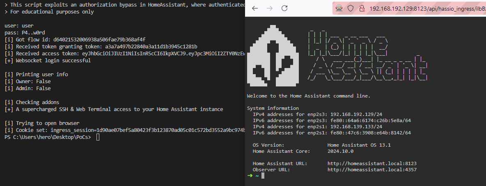

# Authorization bypass in HomeAssistant
---
This writeup describes a vulnerability in HomeAssistant, a popular smart home gateway. HomeAssistant consists of multiple parts, making up its ecosystem and its functionality can be further extended via integrations or addons.

Unfortunately, HomeAssistant (HASS) uses its name quite often within their ecosystem, so we have to make some important distinctions:
- HASS Core - This is the core system, which you can deploy everywhere using docker. This component ultimately integrates with your IoT devices
- HASS Supervisor - It provides quality of life features like backups for HASS Core. When used with HAOS, it can also manage the OS. Sometimes it is referred to by its former name "HASSIO".
- HAOS - The HomeAssistant Operating System can be described as a tailored Docker Engine. It basically runs each component within its own container - this includes stuff like CoreDNS, HASS Core, HASS Supervisor, HASS Observer, different addons and a bunch of other components...

!!!
If you use both HASS Core and HASS Supervisor (not the OS!), this is called a supervised installation.
!!!

I will mostly talk about HASS Core in this blog, but I'll explicitly mention specific components where it is important.

## The Vulnerability
---
HomeAssistant suffers from an authorization bypass, where unprivileged users can access addons, restricted to administrators. The vulnerability lies in HomeAssistants ingress functionality, which proxies requests to the addon. During this process, no validation is performed whether a user is allowed to access the addon.

The impact heavily depends on the installed addons. In case the SSH & Web Terminal Add-on is installed, a user could access the addon's panel and gain RCE on the system.

In order to access an addon, a valid *ingress session cookie* and *ingress URL* is required. These values can be requested by any low privileged user who knows the *addon slug*.



At the time of writing, this vulnerability is present on the latest version of HASS Supervised and HASS Operating System. According to the [opt-in integration analytics](https://www.home-assistant.io/integrations/hassio) provided by Home Assistant, the affected integration was introduced in Home Assistant 0.42 and is used by 80.1% of the active installations (as of October 2024). Although not tested, the vulnerability might also affect Home Assistant Cloud, since it proxies requests.

!!! Important Notice
This vulnerability has already been disclosed to HomeAssistant in August 2023, more information about this can be seen below.
!!!

### Affected Versions
This vulnerability can only be exploited on Supervised or HAOS installations where addons are present:
- HASS Core <= 2024.10.0
- Supervisor <= 2024.09.1
- Operating System <= 13.1

### How does it work

#### Addons and Addon registration
Addons are used to add extra functionality to HomeAssistant, like a web TTY or file editor. These addons run in a separate docker container and can be accessed through HomeAssistant via the ingress functionality.

As soon as the HASSIO integration (the "supervisor" integration) starts its [initialization](https://github.com/home-assistant/core/blob/2024.6.1/homeassistant/components/hassio/__init__.py#L302), `async_setup_addon_panel()` is called, which then retrieves a list of addons from the supervisor and registers them as a `Panel`:

- [async_setup_addon_panel()](https://github.com/home-assistant/core/blob/2024.6.1/homeassistant/components/hassio/addon_panel.py#L20)
	- [hassio_addon_panel.get_panels()](https://github.com/home-assistant/core/blob/2024.6.1/homeassistant/components/hassio/addon_panel.py#L69)
		- [hassio.get_ingress_panels()](https://github.com/home-assistant/core/blob/2024.6.1/homeassistant/components/hassio/handler.py#L443)
		  This function retrieves a list of addons from supervisor via a `GET /ingress/panels` request. You can follow its implementation here
	- [\_register_panel()](https://github.com/home-assistant/core/blob/2024.6.1/homeassistant/components/hassio/addon_panel.py#L79)
		- [panel_custom.async_register_panel()](https://github.com/home-assistant/core/blob/2024.6.1/homeassistant/components/panel_custom/__init__.py#L75)
			- [frontend.async_register_built_in_panel()](https://github.com/home-assistant/core/blob/2024.6.1/homeassistant/components/panel_custom/__init__.py#L125)
				- [Panel()](https://github.com/home-assistant/core/blob/2024.6.1/homeassistant/components/frontend/__init__.py#L279)
				  This is the base panel class, used by every panel within HomeAssistant

#### Panels
Panels can be described as pages, which are rendered inside the HomeAssistant frontend. As described previously, addon frontends are internally handled as `Panel` objects.

When querying the websocket API using `{"type":"get_panels", "id":XX}` as an administrator, HASS returns a list of available panels. Some of these panels have the `require_admin` field set to `true`. According to the [custom panel documentation](https://www.home-assistant.io/integrations/panel_custom/#require_admin), only administrators should be able to see these panels. When querying the same endpoint as a non-admin user, only panels with `require_admin` set to `false` are returned.

```python #10
@callback
@websocket_api.websocket_command({"type": "get_panels"})
def websocket_get_panels(hass: HomeAssistant, connection: ActiveConnection, msg: dict[str, Any]) -> None:
	"""Handle get panels command."""
	
	user_is_admin = connection.user.is_admin
	panels = {
		panel_key: panel.to_response()
		for panel_key, panel in connection.hass.data[DATA_PANELS].items()
		if user_is_admin or not panel.require_admin
	}
	connection.send_message(websocket_api.result_message(msg["id"], panels))
```

!!!
These panels will only be excluded from the sidebar for non-administrators. You can also find this in one of the comments in the panel definition: [`homeassistant\components\frontend\__init__.py`](https://github.com/home-assistant/core/blob/b28cdcfc497dcaabc2d88ac8d3dc4c555edfcbd7/homeassistant/components/frontend/__init__.py#L239)
!!!

#### The API
HomeAssistant has two ways of publishing its API, namely plain HTTP and websockets. One key difference between these is that calls over websockets are always authenticated. The APIs are also protected by regex which both filters potentially harmful traffic and only allows admins access to specific resources.

While HASS Core has many different endpoints, it also proxies requests to the supervisor, which are published through the websocket. Additionally, most of these endpoints require administrative permissions with two exceptions:
1. Requesting information about a specific addon: `{"type":"supervisor/api","endpoint":"/addons/{slug}/info","method":"get","id":XX}`
2. Requesting and validating an ingress session token: `{"type":"supervisor/api","endpoint":"/ingress/session","method":"post","id":XX}`

The first request is used to get information about a specific addon, including its access path (`ingress URL`) while the second call requests a session cookie (`ingress_session`) from the supervisor, which is [required to access the addon URL](https://github.com/home-assistant/supervisor/blob/2024.06.1/supervisor/api/ingress.py#L143). 

With these two values we can now access every addon, provided the slug is known. These slugs can be easily enumerated, but this is outside the scope of this blog.

This snippet shows allowed supervisor API endpoints:
```python #2-7,14
## Endpoints needed for ingress can't require admin because addons can set `panel_admin: false`
WS_NO_ADMIN_ENDPOINTS = re.compile(
	r"^(?:"
	r"|/ingress/(session|validate_session)"
	r"|/addons/[^/]+/info"
	r")$"
)

## ...snip

async def websocket_supervisor_api(hass: HomeAssistant, connection: ActiveConnection, msg: dict[str, Any] -> None:
	"""Websocket handler to call Supervisor API."""
	
	if not connection.user.is_admin and not WS_NO_ADMIN_ENDPOINTS.match(msg[ATTR_ENDPOINT]):
		raise Unauthorized
	## ...snip
```

A valid ingress cookie is the last piece of the puzzle to access the addon:
```python #6
async def handler(self, request: web.Request) -> web.Response | web.StreamResponse | web.WebSocketResponse:
	"""Route data to Supervisor ingress service."""
	
	## Check Ingress Session
	session = request.cookies.get(COOKIE_INGRESS)
	if not self.sys_ingress.validate_session(session):
		_LOGGER.warning("No valid ingress session %s", session)
		raise HTTPUnauthorized()
		
	## ...snip
```

## Disclosure
---
I reported this issue back in August 2023, however I was told, that "user permissions can only be considered a visual change in the Home Assistant UI", which is also highlighted in the official documentation [here](https://www.home-assistant.io/docs/authentication/#user-accounts).